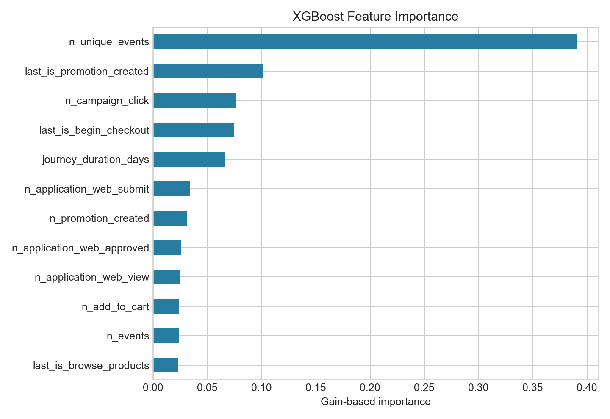
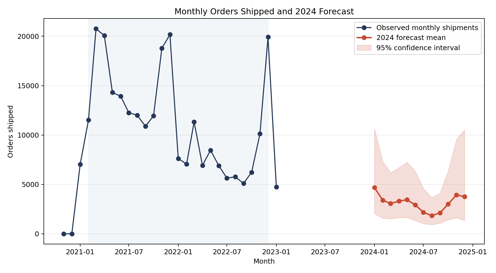

# FingerHut Customer Conversion Rate Modeling

Group project for UCLA Stats M148 that modeled customer conversion from event
journeys and forecasted future order shipments.

**Team:** Charlie Kopp, Isaiah Mireles, and Joel Yoon

<p align="center">
  
  
</p>

## Project Overview

The project used a large, anonymized Fingerhut event log to answer two business
questions:

1. What is the probability that an ongoing customer journey will eventually
   end in an `order_shipped` event?
2. How many orders are likely to ship in future periods?

The raw training data contained approximately **55 million events** across
roughly **1.4 million customer journeys**. Our workflow covered data cleaning,
journey labeling, point-in-time feature engineering, tree-based classification,
model interpretation, time-series forecasting, and sequence-model experiments.

## Approach

- Removed duplicate events and mapped event names to funnel stages.
- Labeled journeys as successful, unsuccessful, or ongoing using shipment
  outcomes and a 60-day inactivity window.
- Sampled historical journeys at intermediate cut points so training examples
  resembled the incomplete journeys seen at prediction time.
- Compared random forest and XGBoost models using probability-focused metrics,
  including Brier score and PR-AUC.
- Excluded outcome-revealing and late-funnel features from the final model to
  reduce leakage.
- Explained predictions with feature importance, ICE plots, and ceteris
  paribus profiles.
- Forecasted shipped-order volume with Prophet and seasonal Poisson regression.
- Explored GRU and LSTM models to represent event order and time gaps directly.

## Selected Findings

- Successful journeys moved through the funnel faster and had shorter gaps
  between actions than unsuccessful journeys.
- Reaching deeper funnel stages, especially downpayment activity, was strongly
  associated with conversion in exploratory analysis. Those late-stage signals
  were excluded from the final non-leaky feature set.
- The number of unique event types was the leading non-leaky XGBoost feature,
  but ICE and local profiles showed that its effect depended heavily on the
  rest of a journey's history.
- A seasonal Poisson model forecast approximately **37,681 orders shipped in
  2024**, with a wide uncertainty interval. This forecast should be interpreted
  as a project exercise because the source data is a historical sample.

See [reports/project-summary.md](reports/project-summary.md) for the complete
group narrative and limitations.

## Repository Structure

```text
.
├── data/                   # Data dictionary and instructions for private data
├── notebooks/              # Supporting exploratory work by contributor
├── reports/
│   ├── course-milestones/  # Group deliverables produced during the course
│   ├── figures/            # Selected model and forecast visualizations
│   └── project-summary.md  # Portfolio-oriented project narrative
└── src/
    ├── python/             # Baseline, explainability, and sequence experiments
    └── r/                  # Data preparation, modeling, and forecasting workflow
```

Each directory contains a README that explains its role.

## Reproducing the Workflow

The competition data is not included because of its size and access
restrictions. Follow [data/README.md](data/README.md) to place the raw and
intermediate files in the expected locations.

For the Python workflows:

```bash
python3 -m venv .venv
source .venv/bin/activate
pip install -r requirements.txt
python3 src/python/model_open_journeys.py
python3 src/python/generate_xgb_explanation_plots.py
```

The R workflow and required packages are documented in
[src/README.md](src/README.md).

## Contributions

- **Charlie Kopp:** R data-cleaning and snapshot pipelines, XGBoost modeling,
  Prophet forecasting, and sequence-model development.
- **Isaiah Mireles:** data cleaning, exploratory analysis, model tuning and
  evaluation, and forecasting analysis.
- **Joel Yoon:** Python baseline modeling, explainability visualizations,
  forecasting and sequence experiments, and supporting notebooks.

This repository is a curated presentation of the group project. The
[original course repository](https://github.com/charlemagnethaging/m148-project)
contains the full working history, including intermediate submissions and
generated artifacts.
