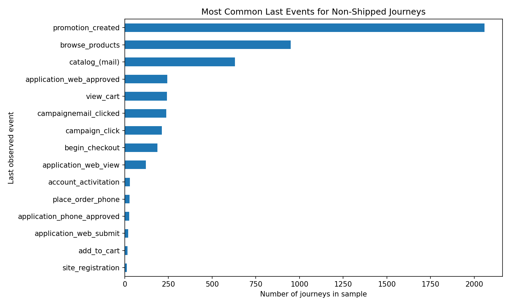

# Project Summary

## Problem

Fingerhut customer journeys are sequences of browsing, application, cart,
checkout, payment, promotion, and shipment events. Our group built a system to
estimate whether an ongoing journey would eventually lead to an order shipment
and to forecast aggregate shipment volume.

## Data and Labeling

The initial training set contained approximately 54.96 million event rows.
After removing about 3.11 million duplicates, roughly 51.85 million events
remained. We mapped event names to funnel stages and defined three journey
outcomes:

- Successful journeys eventually reached `order_shipped`.
- Unsuccessful journeys did not ship and had been inactive for at least 60
  days.
- Ongoing journeys had not shipped but were active within the final 60 days.

Completed journeys are not directly comparable to ongoing journeys because
their outcomes are already visible. To create realistic training examples, we
sampled intermediate cut points from completed journeys and calculated features
using only the events visible before each cut.

## Conversion Modeling

Our baseline was a random forest built on journey-level timing, frequency,
event-count, and recent-action features. The later workflow compared random
forest and XGBoost models, downsampled successful journeys to approximate the
lower conversion prevalence among open journeys, and evaluated probabilistic
predictions with Brier score and PR-AUC.

Leakage was a central concern. Features that directly revealed the outcome or
occurred very late in the funnel, such as shipment, order-placement, and
downpayment counts, were removed from the final classifier.

## Interpretation

The number of unique event types was the leading non-leaky feature in the
XGBoost interpretation workflow. Its relationship with conversion was
nonlinear and interaction-dependent:

- [ICE profiles](figures/xgb_ice_plot.png) showed substantial variation across
  journeys.
- [Ceteris paribus profiles](figures/xgb_cp_profiles.png) showed that increasing
  event variety helped some journeys much more than others.

These plots explain model behavior, not causal effects.

## Journey Analysis

Exploratory analysis found that successful journeys moved through the funnel
more quickly and had shorter gaps between actions. Downpayment and other deep
funnel stages strongly separated successful journeys from ongoing and
unsuccessful journeys, while unsuccessful journeys were more likely to stop in
early or uncategorized stages.

## Forecasting

The team modeled aggregate `order_shipped` counts at daily, weekly, and monthly
frequencies. Prophet was used to examine trend, seasonality, holidays, and the
effect of inconsistent weekend shipment records. A separate seasonal Poisson
regression provided an interpretable monthly forecast.

The seasonal Poisson exercise forecast approximately 37,681 total shipments in
2024, with a wide approximate 95% interval of 17,753 to 81,608. The interval
reflects substantial uncertainty, and the source data is a project sample
rather than a complete operational shipment history.

## Sequence Experiments

The group also explored GRU and LSTM models that encoded event order and time
gaps directly. These experiments extended the tree-based workflow but required
more computation and careful calibration. They are retained in `src/python/experiments`
and `src/r/modeling`.

## Limitations

- The real open-journey distribution can differ from snapshots sampled from
  completed historical journeys.
- Accuracy alone is misleading under strong class imbalance; calibration and
  probability-focused metrics are more informative.
- Funnel features that are strongly associated with conversion can also leak
  the outcome when they occur too close to shipment.
- The forecasting data contains incomplete early periods and inconsistent
  weekend activity.
- Raw competition data is not publicly redistributed in this repository.
